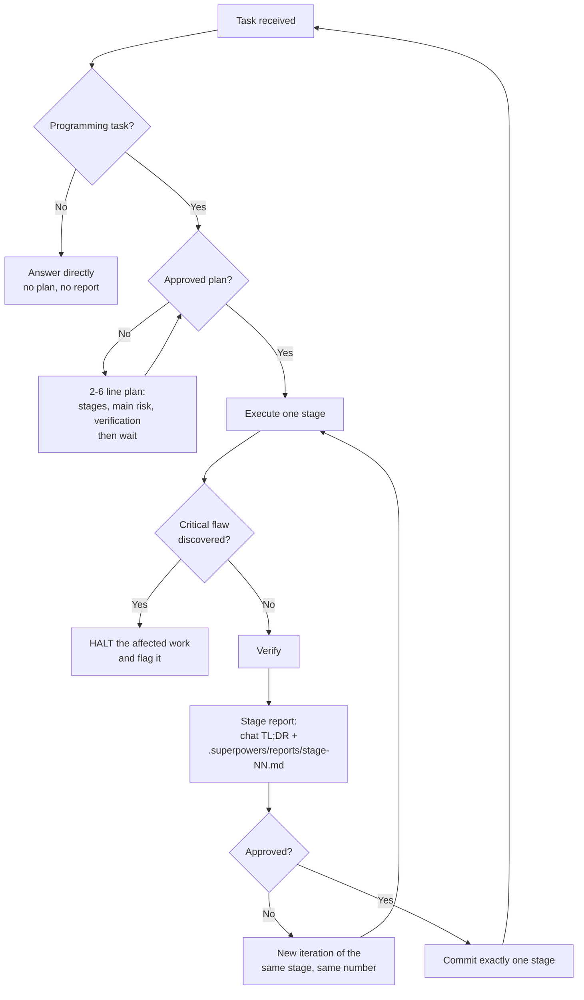

# AGENTS.md — Behavioral Contract for AI Coding Agents

A ready-to-adopt agent instruction file that turns any capable LLM coding agent into a disciplined, honest senior engineer. It encodes adversarial review, strict approval boundaries, a stage-and-report delivery model, and code-quality rules — so you get a strategic mirror, not a cheerleader.


---

## Table of Contents

- [Introduction](#introduction)
- [Why This Prompt Exists](#why-this-prompt-exists)
- [Tech Stack and Requirements](#tech-stack-and-requirements)
- [Project Structure](#project-structure)
- [Quick Start](#quick-start)
- [How the Contract Works](#how-the-contract-works)
- [Code Discovery](#code-discovery)
- [Verbatim Strings](#verbatim-strings)
- [Limitations](#limitations)
- [Recommendations](#recommendations)
- [Support](#support)
- [Contributing](#contributing)
- [License](#license)
- [Acknowledgements](#acknowledgements)

---

## Introduction

This repository publishes a single file — **`AGENTS.md`** — that acts as a complete behavioral contract for an AI coding agent. Where most agent prompts optimize for obedience, this one optimizes for **truthfulness and discipline**.

It installs six rule groups into the agent's working context:

- **Advisor stance** — the agent challenges weak reasoning, names self-deception, and states "Nothing to report" when there is genuinely nothing to report. It never fabricates findings to look useful.
- **Delivery discipline** — work is split into stages; a stage is the unit of approval, of reporting, and of committing. A rejected stage starts a new iteration of the same stage instead of a new one.
- **Honest diagnostics** — a strict protocol for bug reports, speculative risks, and non-critical findings, including mandatory escalation to a tracked `IMPROVEMENTS.md` backlog.
- **Code quality** — obvious over clever, maintainable over elegant, comments that explain *why*, fail-fast validation, and a critical/trivial test that decides whether a test earns its keep.
- **Scope of application** — an explicit list of which rules are global and which apply only inside a project with an approved plan.
- **Graph-based code discovery** — a knowledge graph of the project takes priority over grep and glob, with three defined evidence tiers and explicit rules about what a graph result does and does not prove.

> [!NOTE]
> The file deliberately *inverts* the common skill-first setup. Rule 1.1 states that the file outranks session-injected skill mandates, and rules 1.2–1.4 treat loading a skill "just in case" as a defect. Adapt that stance only if your workflow depends on skills.

---

## Why This Prompt Exists

Default agent behavior has a known failure mode: it is agreeable. It flatters, complies blindly, and hides uncertainty. Used for months, this silently degrades code quality, buries real risks, and lets junior-level mistakes pass unreviewed.

This prompt is a corrective. It treats the agent as a **senior engineer with a spine**:

- Between comfortable and honest, it selects honest.
- Between "just do it" and "ask first," it selects **ask first** whenever behavior would change.
- Between bloat and minimalism, it selects minimal and forces justification for every abstraction.
- Between "looks plausible" and "verified," it selects verified.

The outcome is a partner that challenges the plan before approval, executes precisely afterward, halts loudly on a critical flaw, and never quietly defers a problem it found.

---

## Tech Stack and Requirements

This repository ships prose, not code, so the stack is deliberately short. The table below is the "tech stack" for a single-artifact prompt project.

| Category | Technology / Requirement |
|---|---|
| Artifact | `AGENTS.md` — GitHub-flavored Markdown, 192 lines |
| Instruction standard | `AGENTS.md` (agents.md standard), plus equivalents such as `CLAUDE.md` where required |
| Runtime | Any AI coding agent that loads a project-level or user-level instruction file |
| Optional dependency | `subagent-driven-development` skill — used only for genuinely multi-task plans (rule 1.17) |
| Optional MCP server | `codebase-memory-mcp` — the knowledge graph behind section 6. Rules 6.1–6.4 degrade to plain tools without it |
| Build / test / CI | None — the artifact is not executable |
| License | MIT |

No runtime, package manager, or environment variable is involved. Installing the contract is a file copy; installing the knowledge graph is a separate, optional step described in [Code Discovery](#code-discovery).

---

## Project Structure

```
ai-agent-system-prompt/
├── AGENTS.md                            # The behavioral contract (the artifact)
├── README.md                            # You are here
├── LICENSE                              # MIT license
└── .gitignore                           # OS and editor cruft
```

The repository has no `src/`, no tests, and no dependency manifest. That is the intended shape: the deliverable is a text file that is read, not a program that is run.

---

## Quick Start

All installation variants are listed below. Choose by how widely you want the contract to apply.

### Option A: Copy into a single project (recommended)

Applies the contract to one repository only.

```bash
cp AGENTS.md /path/to/your-project/AGENTS.md
```

### Option B: Symlink for a single source of truth

Keeps the file in this repository as the canonical copy while multiple projects consume it. Edits here propagate everywhere.

```bash
ln -s /path/to/ai-agent-system-prompt/AGENTS.md /path/to/your-project/AGENTS.md
```

### Option C: Install at user level

Applies the contract to every session of one agent, regardless of repository. The path depends on the agent — for example `~/.config/opencode/AGENTS.md` for opencode.

```bash
cp AGENTS.md ~/.config/opencode/AGENTS.md
```

### Option D: Reference as context

Load the file through whatever mechanism your agent uses for persistent instructions — a knowledge file, a rules file, or an explicit reference in your own prompt. Content is identical; only the loading mechanism differs.

### Verifying the installation

Ask the agent a question that requires the contract to answer, for example: *"What do you do when you find a non-critical issue?"* A compliant agent names the `IMPROVEMENTS.md` backlog and the stage report rather than answering vaguely. If it does not, the file is not being loaded.

---

## How the Contract Works

The delivery model is a stage loop. Every programming task moves through it; questions and research do not.



### The rules, by section

| Section of `AGENTS.md` | What it governs |
|---|---|
| 0. Advisor Stance | Challenge before approval, execute precisely after, HALT on a critical flaw |
| 1. Core Interaction Principles | Precedence, skill discipline, approval boundary, stage model, stage report, iteration boundary |
| 2. Problem Handling | Honest diagnostics, problem-fix protocol, escalation of non-critical findings |
| 3. Additional Best Practices | Stage review gate, commit protocol, commenting rules |
| 4. Code Quality | Simplicity, readability, fail-fast, dead code, testing discipline |
| 5. Scope of Application | Which rules are always on, and which require an approved plan |
| 6. Codebase Memory | Graph-first code discovery, evidence tiers, and what an index result does not prove |

### Deliverables the contract creates in your project

| Artifact | Location | Versioned | Purpose |
|---|---|---|---|
| Stage report | `.superpowers/reports/stage-NN-<name>.md` | No — must be gitignored | Full record: result, verification, problems, notes |
| Improvement backlog | `IMPROVEMENTS.md` | Yes — never gitignored | Every non-critical finding, one line per entry |

> [!IMPORTANT]
> The contract instructs the agent to add `.superpowers/reports/` to your `.gitignore` in the stage that creates it. `IMPROVEMENTS.md` is explicitly never ignored — a backlog that is not versioned does not survive.

### Approval boundaries in short

- No functional change without explicit approval. Approval is per stage and authorizes nothing outside it.
- Two narrow exceptions exist: fully reversible non-functional edits, and bug fixes that stay inside the approved stage's scope. Both are reported.
- Everything else — wording, formatting, file placement, trivially reversible details — is resolved without asking, and stated in one line.
- Ambiguity about your intent or a product decision is never trivial; it is always worth a question.

### Commits

One stage, one commit, in the format `type: brief description`, where `type` is one of `feat`, `fix`, `refactor`, `chore`, `docs`, `style`, `perf`, `test`, `ci`, `build`. Approval of a stage *is* the request to commit that stage — nothing is committed on your behalf without it.

---

## Verbatim Strings

The contract is not command-driven: it applies to every interaction without being invoked. There is no directive command language to learn.

A small number of phrases are specified verbatim, because the exact wording is part of the requirement:

| Phrase | Where it is required |
|---|---|
| `HALT` | The agent's response to a critical flaw discovered after approval (section 0) |
| `Nothing to report.` | The required answer when a review finds no real problem (rule 2.1) |
| `No defects detected. All logic is consistent.` | The required answer when a diagnostic finds no defect (rule 2.1) |
| `I don't know` | The required answer when the agent is uncertain, together with what information would help |
| `type: brief description` | The commit message format, where `type` is `feat`, `fix`, `refactor`, `chore`, `docs`, `style`, `perf`, `test`, `ci`, or `build` (rule 3.2) |

> [!NOTE]
> An earlier version of this prompt shipped a seven-command directive set (`PLAN APPROVED`, `PONYTAIL REVIEW`, `DOCS UPDATE`, `CODE REVIEW`, `GRILL`, `SUMMARIZE`, `HALT`). It was removed — the stage/iteration model replaced it. If you rely on those markers, define your own; the contract does not implement them.

---

## Code Discovery

Section 6 makes a persistent knowledge graph of the project the primary tool for code discovery, ahead of grep, glob, and file-by-file reading. The argument is quantitative: a handful of structural queries costs roughly two orders of magnitude fewer tokens than reading the files they describe.

The graph is produced by tree-sitter parsing and stored locally in `~/.cache/codebase-memory-mcp/`. It is a structural backend with no LLM inside — the agent remains the layer that turns a question into a graph query.

### Installing the server

This step is optional. Without it, rules 6.1–6.4 degrade to plain tools and the rest of the contract is unaffected.

```bash
bash ~/.local/bin/install.sh
codebase-memory-mcp uninstall   # removes the MCP entry in opencode.jsonc, the skill, the agents, and the plugin
```

Index a project with `index_repository`; a background watcher keeps the index current afterwards. The graph UI is available at `http://localhost:9749`:

```bash
codebase-memory-mcp --ui=true --port=9749
```

### Tool priority

| Tool | Answers |
|---|---|
| `search_graph` | Functions, classes, routes, and variables by name pattern, label, and degree |
| `trace_path` | Callers (inbound) or callees (outbound) of a symbol |
| `get_code_snippet` | The exact source of a qualified symbol |
| `check_index_coverage` | Whether a cited path is indexed and free of gaps |
| `query_graph` | Cypher, for questions the dedicated tools do not cover |
| `get_architecture` | Languages, packages, entry points, routes, hotspots, and boundaries in one call |

### Evidence tiers

The tier decides what a conclusion is allowed to claim.

| Tier | Name | Use | Not allowed |
|---|---|---|---|
| 1 | Scout | A few narrow calls for a quick positive answer | Claims of absence, exhaustive impact, dead code |
| 2 | Verify | Task-directed evidence, both trace directions where the direction matters, exact snippets for material claims | — (default tier) |
| 3 | Auditor | Bounded scope, current generation, complete relevant pagination | Anything without stating a limitation |

> [!IMPORTANT]
> A clean coverage result means "no recorded gap", never completeness. Before any negative claim — nothing calls it, no such route, this is dead code — the agent must run `check_index_coverage` and then read or grep every range and file reported as partial, skipped, stale, or unknown. The index can also lag: the project and its generation are re-confirmed at session start, after a compaction, and after a pull, because a stale index answers confidently and wrongly.

The graph indexes code, not everything else. String literals, error messages, config values, shell scripts, Dockerfiles, and CI files stay with grep, glob, and read — as does any question the graph cannot answer usefully.

---

## Limitations

Stated plainly, because the file that preaches honesty should practice it:

- **It is prose, not code.** Nothing is compiled, tested, or executed. A malformed rule cannot be caught by a test suite; only a human reading it will notice.
- **It does not replace human oversight.** It *increases* assertiveness, so the agent will push back and pause work that you did not expect to be paused.
- **It is slower on trivial work.** Ask-before-acting and stage-by-stage execution cost more than a permissive agent would spend on a one-line change.
- **It is bounded by the underlying model.** The contract sharpens behavior; it cannot add reasoning capability the model does not have.
- **It is inert if the agent does not load it.** Not every agent reads `AGENTS.md`; some expect a different filename or an explicit reference. Verify, as described in Quick Start.
- **Its skill stance is opinionated.** Rules 1.1–1.4 demote skills to tools and override session-injected skill mandates. In a workflow built around mandatory skills, this contract will fight the harness.
- **Section 6 depends on an MCP server you may not run.** The graph rules are inert without `codebase-memory-mcp`, and an agent that reports "no such symbol" from an unindexed project has produced a false negative that the coverage rule exists to prevent.
- **The graph is a point of failure, not an oracle.** Every rule 6.2 adds exists because a confident wrong answer from a stale or partial index is worse than no answer.

---

## Recommendations

- Start on a **non-critical project you already know well.** The first interactions are noticeably more assertive; calibrate expectations before running it on anything urgent.
- **Read section 5 first.** It tells you which rules are unconditional and which activate only inside a project with an approved plan — the most common source of surprise. Note that section 6 is unconditional.
- **Expect a one-line plan even for a one-line change.** That is rule 1.15 working as designed, not friction to route around.
- **Check `IMPROVEMENTS.md` periodically.** It is a running record of the shortcomings the agent noticed and deliberately did not fix, which is more useful than a report that claims nothing was found.
- **Install the knowledge graph on a large codebase, and read section 6 in full on a small one.** The token economics that justify graph-first discovery only pay off once the project is big enough to hurt.
- **Adapt rather than fork.** The file is one document with numbered rules; if a rule does not fit your workflow, change that rule instead of maintaining a separate variant.
- **Decide the skill question before installing.** If your agent's harness injects mandatory skills, reconcile rules 1.1–1.4 first.

---

## Support

- Report behavioral problems and rule ambiguities through [GitHub Issues](https://github.com/dimassaa/ai-agent-system-prompt/issues).
- Use pull requests for proposed rule changes; each PR is reviewed against the philosophy in [Why This Prompt Exists](#why-this-prompt-exists).

---

## Contributing

Contributions are welcome. The artifact is a prompt, so review criteria are stricter than they look:

1. Open an issue describing the behavior change before submitting a pull request.
2. Every rule must be a self-contained instruction that answers *why*, not only *what*.
3. Numbering is load-bearing — rules reference each other (for example 1.7 cites 1.14, and section 5 enumerates rules by number). Renumbering is a breaking change; update every cross-reference in the same PR.
4. Explain in the PR body what changed, why this way, and which alternative you rejected.
5. Do not add features that the file does not currently need. Rule 4.3 applies to the prompt itself.

`AGENTS.md` is the only maintained artifact. This README documents it and carries no rules of its own.

---

## License

Distributed under the [MIT License](LICENSE). See `LICENSE` for details.

---

## Acknowledgements

- Inspired by the recurring failure mode of agreeable coding agents.
- Inspired by programming style guides that insist code be written for the human reading it at three in the morning.
